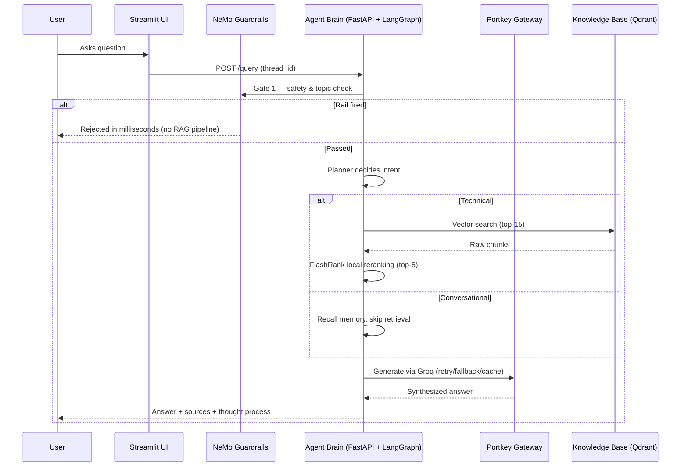
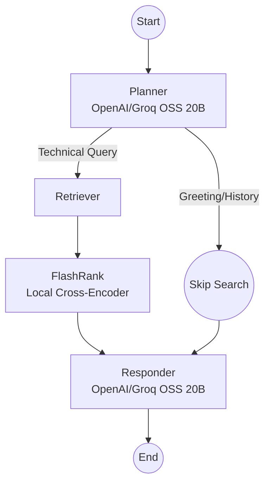
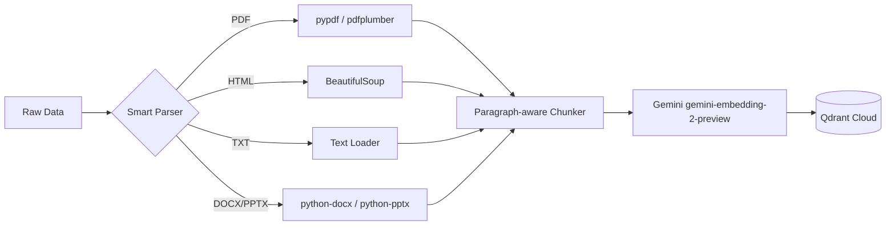

# 🛡️ Aegis RAG
### Enterprise Agentic Retrieval Platform

### 🚀 Live Demo

**[Open Aegis RAG →](http://rag-alb-1852290112.us-east-1.elb.amazonaws.com/ui)**

> *Aegis — the shield. A RAG system that doesn't just answer questions, it guards, routes, reranks, and proves its own correctness.*

A production-grade, state-of-the-art **Agentic RAG** system built for speed, scalability, safety, and deep observability. Aegis RAG combines a **LangGraph** reasoning core, a fully local reranking layer, an enterprise **guardrails** gate, a resilient **LLM gateway**, and a rigorous **evaluation pipeline** — all running on a cloud-agnostic, mostly local-first stack.

---

## 🌟 Why "Aegis"?

Most RAG systems are a single, brittle path: embed → search → generate. Aegis is layered like a shield:

1. **Guardrails (NeMo)** — the outer layer. Blocks jailbreaks, off-topic noise, and unsafe input before it ever reaches an LLM.
2. **Gateway (Portkey)** — the resilience layer. Retries, falls back, caches, and observes every LLM call.
3. **Agentic Core (LangGraph)** — the brain. Plans, retrieves, reranks, and responds.
4. **Evals (RAGAS + DeepEval)** — the proof. Continuously measures faithfulness, relevance, and correctness so regressions are caught before users ever see them.

---

## 🧭 Vision

Most RAG systems fail because they treat every query the same. Aegis distinguishes between:

1. **Conversational queries** — *"Hi", "Who are you?", "What did I just say?"*
2. **Technical queries** — *"How do I configure Intel SR-IOV on Kubernetes?"*

Using a **Planner → Retriever → Responder** architecture, technical answers stay grounded in verified "true data," while conversational turns stay fast and fluid — never touching the vector database unnecessarily.

---

## 🏗️ High-Level Request Flow



---

## ☁️ Production Deployment

The application is containerized with Docker and deployed on AWS using:

- **Amazon ECR** — Docker image registry
- **Amazon ECS Fargate** — Serverless container execution
- **Application Load Balancer** — Public HTTP/HTTPS traffic routing
- **AWS Secrets Manager** — Secure API key and credential management
- **CloudWatch Logs** — Container logs and runtime diagnostics

### Production Architecture

```text
                    Internet
                       │
                       ▼
              Application Load Balancer
                       │
              ┌────────┴────────┐
              │                 │
           /ui*             /query
              │                 │
              ▼                 ▼
        ECS Fargate        ECS Fargate
         Streamlit           FastAPI
           :8501              :8080
              │                 │
              └────────┬────────┘
                       │
              Qdrant / Portkey /
              LLM / Guardrails
```

## 📦 System Components

| Layer | Technology | Role |
|---|---|---|
| **Ingestion** | pypdf, pdfplumber, BeautifulSoup, python-docx, python-pptx | Parse raw enterprise docs into clean text |
| **Chunking** | Custom paragraph-aware splitter | 1500-char chunks, paragraph boundaries preserved |
| **Embeddings** | Google `gemini-embedding-2-preview` | 3072-dim vectors tuned for retrieval |
| **Vector Store** | Qdrant Cloud | Cosine-similarity search, top-15 candidates |
| **Reranking** | FlashRank (`ms-marco-MiniLM-L-6-v2`, ONNX, local CPU) | Cross-encoder rerank to top-5, zero cloud cost |
| **Agent Orchestration** | LangGraph (Planner → Retriever → Responder) | Cyclic state machine with conversational memory |
| **Guardrails** | NeMo Guardrails (Colang) | Off-topic guard, jailbreak shield, dialog control |
| **LLM Gateway** | Portkey | Retries, fallback, load balancing, caching, observability |
| **LLM Provider** | OpenAI/Groq (`openai/gpt-oss-20b`) | Generation via Portkey gateway |
| **Observability** | Pydantic Logfire + LangSmith | Infrastructure spans + agent/LLM trace views |
| **Evaluation** | RAGAS 0.4.3 + DeepEval (Jaccard) | 6 metrics across retrieval, generation, and tool-routing |
| **Backend** | FastAPI | `/query` endpoint, two-gate request handling |
| **Frontend** | Streamlit | Source-transparent chat UI + eval dashboard |

---

## 🤖 The Agentic Brain (LangGraph)



- **Planner** — classifies intent as `CONVERSATIONAL` or `TECHNICAL`; only generates a search query when necessary.
- **Retriever** — two-stage pipeline: Qdrant bi-encoder search (top-15) → FlashRank cross-encoder rerank (top-5). Falls back gracefully to raw Qdrant scores if FlashRank fails.
- **Responder** — synthesizes the final answer, grounded strictly in retrieved context for technical queries, and cites sources.
- **Memory** — `MemorySaver` keeps a `thread_id`-scoped conversation history so context survives across turns (and backend restarts, given the same thread).

---

## 🛡️ Guardrails — The Safety Gate

Built with **NeMo Guardrails** (Colang DSL). Runs as **Gate 1**, before the LangGraph pipeline is ever touched.

| Rail | Type | Blocks |
|---|---|---|
| Off-topic guard | Intent | Jokes, recipes, weather — anything outside the domain |
| Jailbreak shield | Intent | "Ignore all instructions", "You are now DAN", etc. |
| Dialog control | Intent | Greetings, farewells, capability questions |

A jailbreak or off-topic message is rejected in milliseconds — Qdrant, FlashRank, and the 70B model are never called.

---

## 🔀 LLM Gateway — The Resilience Layer

Built with **Portkey**, sitting between every LLM call and Groq. Zero changes to business logic.

- **Automatic retries** on transient errors (429/500/503)
- **Fallback** configured in Portkey dashboard
- **Request caching** (exact-match on free tier; semantic on Enterprise)
- **Full observability** — every call logged with cost, latency, and model actually used
- **Two isolated Groq keys** — production traffic never competes with eval traffic for rate limits

```
Guardrails → "Should this request happen at all?"
Gateway    → "How should this request be sent?"
```

---

## 🧪 Evaluation Pipeline — The Proof Layer

A 15-question **golden dataset**, drawn from real enterprise docs (Kubernetes Jobs, HPA/VPA, CronJobs, Databricks CLI), plus 6 guardrails test cases, scored across **6 independent metrics**:

| # | Metric | Layer | Catches |
|---|---|---|---|
| 1 | Faithfulness | Generation | Hallucinated facts not in context |
| 2 | Answer Relevancy | Generation | Answers that miss the actual question |
| 3 | Context Precision | Retrieval | Noisy chunks ranked above useful ones |
| 4 | Context Recall | Retrieval | Missing chunks the answer needed |
| 5 | Answer Correctness | Generation | Factual mismatch vs. ground truth |
| 6 | Tool Correctness | Agent | Wrong tool routing (Jaccard, zero LLM cost) |

Run in two phases: **Phase 1** collects live responses from the running API; **Phase 2** scores them with RAGAS (judge: `openai/gpt-oss-20b` on a dedicated key, paced to respect rate limits). Results surface in a Streamlit dashboard, with every trace visible in Logfire.

**Score thresholds:** 🟢 ≥ 0.75 ship it · 🟡 0.50–0.75 investigate · 🔴 < 0.50 fix before shipping.

---

## 🕵️ Observability

| Tool | Tracks |
|---|---|
| **Pydantic Logfire** | API latency, parser selection, Qdrant query time, gateway cache hits |
| **LangSmith** | Graph state transitions, prompt versions, token usage, chain-of-thought |

All traces share a common `trace_id`, so any UI bug can be traced end-to-end from LangSmith's agent view into Logfire's infrastructure view.

---

## 📥 Ingestion Engine



Runs entirely on-device — no external OCR service required. Chunks are 1500 characters, split on paragraph boundaries to avoid mid-sentence cuts.

```powershell
python -m app.ingestion.processor DATA --wipe
```

---

## 📂 Project Organization

```
├── app/
│   ├── agents/
│   │   └── nodes/       # Planner, Retriever, Responder LangGraph nodes
│   ├── gateway/         # Portkey LLM gateway — primary + fallback Groq routing
│   ├── guardrails/      # NeMo Guardrails input/output filtering
│   ├── ingestion/
│   │   ├── chunking/    # Paragraph-based text splitter (1500 char max)
│   │   └── loaders/     # Local parsers — PDF (pypdf), HTML, TXT, DOCX, PPTX
│   ├── services/
│   │   └── retrieval/   # Gemini embeddings + Qdrant search + FlashRank reranking
│   ├── config.py        # Centralized environment variable management
│   └── main.py          # FastAPI entrypoint — guardrails gate + /query endpoint
├── evals/               # RAGAS evaluation suite + Streamlit 3-tab demo
├── ui/                  # Streamlit chat interface with reasoning step transparency
├── processed_data/      # Auto-generated — parsed & chunked JSON output per document
├── DATA/                # Sample datasets (True vs Noisy documentation)
└── requirements.txt     # Pinned dependencies
```

---

## 🔑 Environment Variables

| Variable | Purpose |
|---|---|
| `GROQ_API_KEY` | Primary Groq key — Planner + Responder nodes |
| `GROQ_FALLBACK_API_KEY` | Portkey fallback target |
| `PORTKEY_API_KEY` | LLM gateway — routing, retries, caching, observability |
| `GEMINI_API_KEY` | Embedding generation (3072-dim) |
| `QDRANT_API_KEY` / `QDRANT_CLUSTER_ENDPOINT` | Vector database access |
| `LOGFIRE_TOKEN` | Infrastructure tracing |
| `LANGSMITH_API_KEY` / `LANGSMITH_PROJECT` / `LANGSMITH_TRACING` / `LANGSMITH_ENDPOINT` | Agent tracing |
| `JUDGE_GROQ` | Dedicated key for the RAGAS eval judge — isolated from production traffic |
| `BACKEND_URL` | URL the Streamlit UI uses to reach FastAPI |

Copy `.env.example` to `.env` and fill in your values before running anything. Never commit `.env` to Git.

---

## ⚠️ Key Architectural Decisions

- **Lazy initialization everywhere** — Gemini embeddings and FlashRank load on first use, not at import time, so the FastAPI server boots in milliseconds and Logfire never gets "poisoned" by premature calls.
- **Logfire configured before any other import** in `app/main.py`, using `os.getenv()` directly rather than importing `app.config`, to guarantee tracing is live before any nested module can log.
- **Custom FlashRank implementation** instead of LangChain's native wrapper, for granular Logfire spans, true lazy loading, bulletproof fallback to Qdrant scores, and a lightweight `List[str]` state instead of heavy `Document` objects.
- **Two Groq keys** (production vs. judge) so eval runs can never rate-limit the live application.
- **RAG_INDICATORS-based rail detection** — since `LLMRails.generate()` returns a plain string with no `fired` flag, the system detects a fired rail by matching against unique phrases from each `define bot` block.

---

## 🚀 Quick Start

```powershell
# Terminal 1 — start the FastAPI backend
uvicorn app.main:app --reload --port 8000

# Terminal 2 — start the Streamlit UI
streamlit run ui/app.py

# Terminal 3 (optional) — run the eval suite
streamlit run evals/app.py
```

---


*Built for enterprises that need their RAG system to be fast, safe, observable, and provably correct — not just plausible.*
